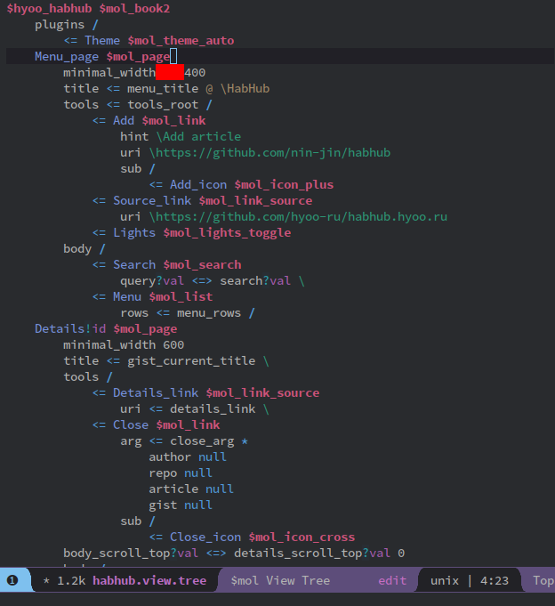

# mol-tree-mode

Major mode for editing [$mol tree](https://github.com/nin-jin/tree.d) files.

`.view.tree` language described at [$mol_view](https://github.com/hyoo-ru/mam_mol/blob/master/view)

## Features

- Syntax highlighting for `.tree` files (including `.meta.tree`, `.view.tree`)
- Showing errors: wrong whitespaces

## Hotkeys

- `S-tab`, `backtab` - cycle indention
- `C-S-right`, `C-S-left` - shift selected region by 1 TAB

## TODO

- [ ] Add support nested commented block in .view.tree
